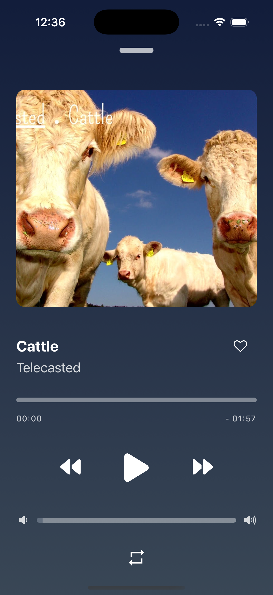
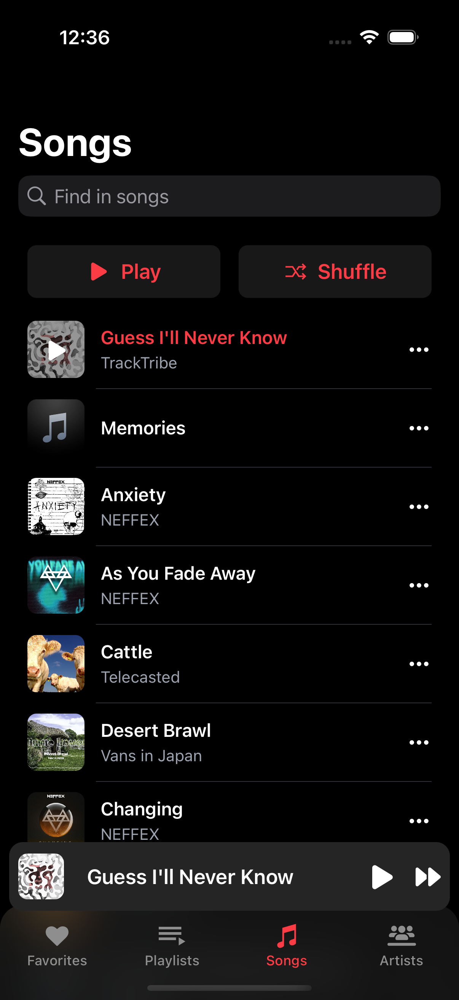
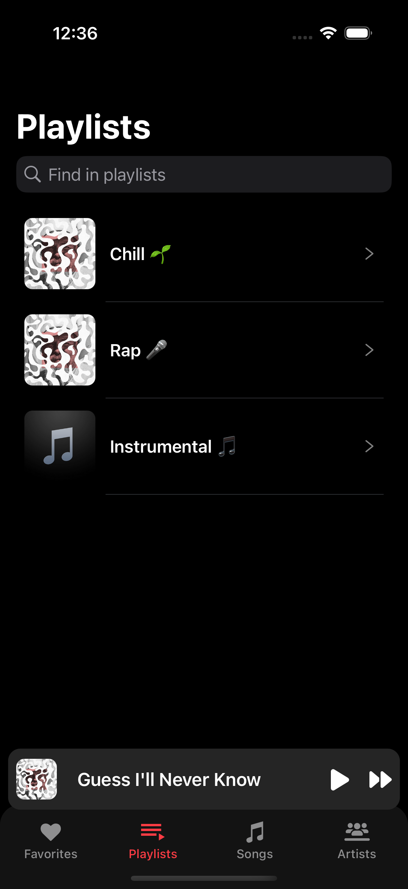

# Music App

## Description
This is a music application built with React Native and Expo, featuring smooth UI interactions, advanced audio playback, and playlist management.

## Features
- **Audio Playback:** Built with `react-native-track-player` for seamless music streaming.
- **Navigation:** Uses `@react-navigation/native-stack` and `expo-router` for efficient screen transitions.
- **Custom UI Elements:** Utilizes `react-native-reanimated`, `react-native-gesture-handler`, and `expo-linear-gradient` for a polished experience.
- **Image Processing:** `react-native-fast-image` and `react-native-image-colors` enhance artwork loading and UI theming.
- **State Management:** `zustand` ensures a lightweight and efficient global state.

## Installation
1. Clone the repository:
   ```sh
   git clone https://github.com/ruveydakisla/music-app.git
   cd music-app
   ```
2. Install dependencies:
   ```sh
   yarn install
   ```
3. Start the development server:
   ```sh
   npx expo run:ios
   ```

## Technologies Used
 - **React Native** (0.76.7)
 - **Expo** (52.0.37)
 - **State Management:** Zustand
 - **Navigation:** React Navigation & Expo Router
 - **Audio Player:** React Native Track Player
 - **UI Enhancements:** Reanimated, Gesture Handler, Linear Gradient

## Screenshots

Here are some screenshots from the app:

<table>
  <tr>
    <td></td>
    <td></td>
         <td></td>

  </tr>
</table>
---

